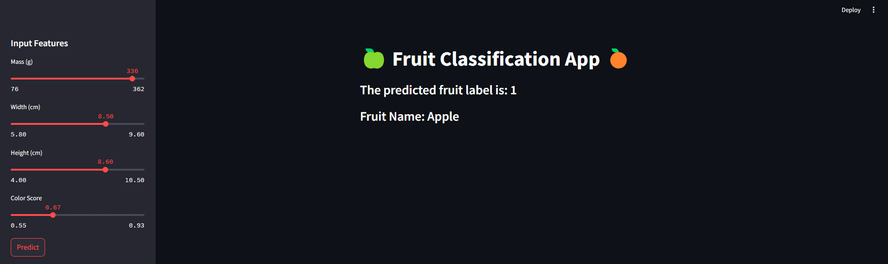
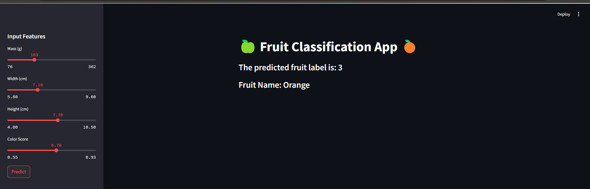
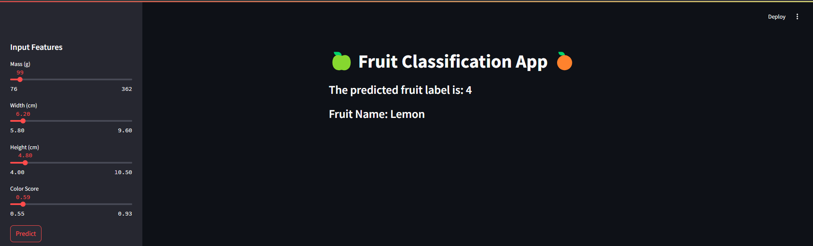

# Fruit Classification Project (For learning purpose & fun)

## Overview

This project focuses on building a machine learning model to classify different types of fruits based on their physical characteristics. The dataset used for this project contains various attributes of fruits, including mass, width, height, and color score. By leveraging these features, we aim to accurately predict the type of fruit.

## What We Do

1. **Data Ingestion**: 
   - We load the fruit dataset into a Pandas DataFrame for easy manipulation and analysis.

2. **Data Preprocessing**: 
   - We perform exploratory data analysis (EDA) to understand the dataset better. This includes checking for missing values, visualizing distributions, and exploring relationships between features.
   - Unwanted columns are removed to streamline the dataset for modeling.

3. **Model Building**: 
   - We implement Random Forest machine learning model with around 95% accuracy
   - The model is evaluated using cross-validation techniques to ensure robustness and reliability.

4. **Model Evaluation**: 
   - We compare the performance of the model using accuracy scores and visualizations such as confusion matrices.

5. **Deployment**: 
   - Finally, we create a user-friendly Streamlit application that allows users to input fruit characteristics and receive predictions on the type of fruit.

## Output

